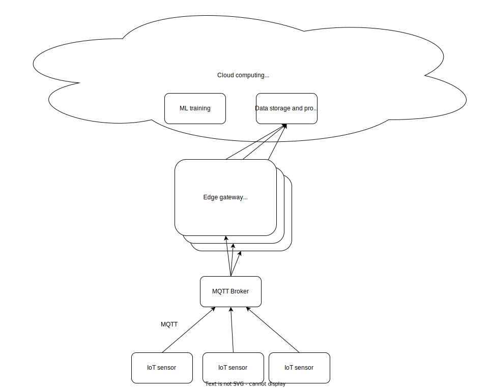

Developing:

run

```
docker compose up -d --build gateway iot_node cassandra1 grafana mqtt
```

to force rebuild of custom images and start services. Shut down system by running 

```
docker compose down
```
To access Grafana open `localhost:3000` in web browser and enter 'admin' as both username and password.

